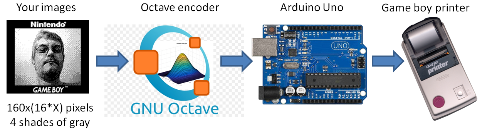
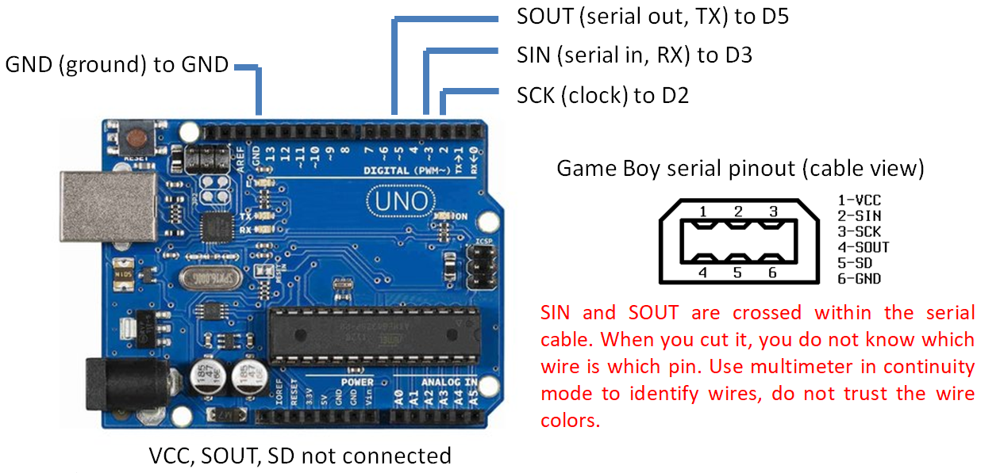
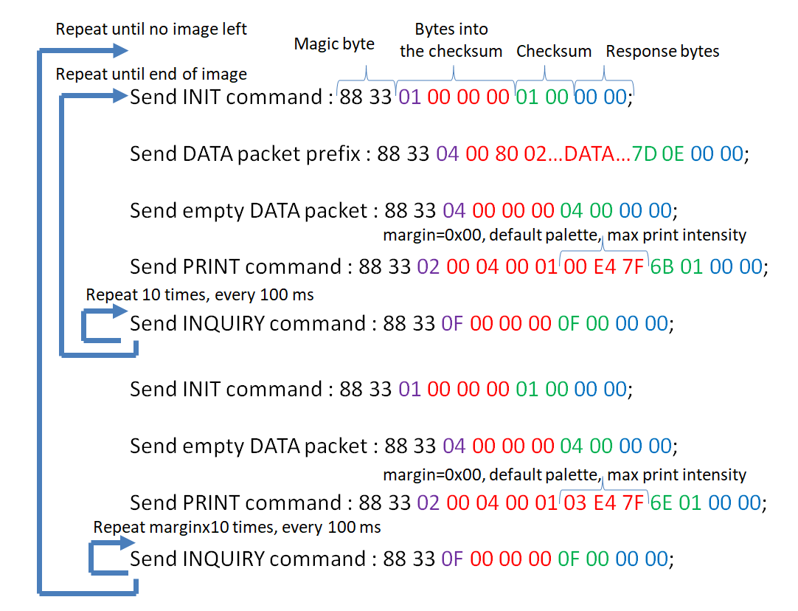
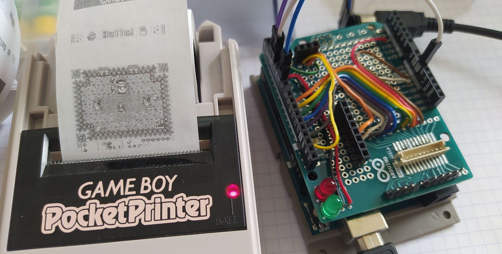

# A simple PC to Game Boy Printer interface with an Arduino

The most cheap and basic setup you can imagine to print something from a PC to a Game Boy Printer ! The Arduino code is the same used in the [GBCamera-Android-Manager](https://github.com/Raphael-Boichot/GBCamera-Android-Manager). The code originates from an [SD based version](https://github.com/Raphael-Boichot/The-Arduino-SD-Game-Boy-Printer) which is more stable and time accurate but requires an SD shield. The project here requires nothing but an Arduino Uno and a PC.

Alternatively, instead of the Arduino core provided here, you can directly use the [Game Boy printer emulator](https://github.com/mofosyne/arduino-gameboy-printer-emulator), it is natively compatible with the GNU Octave script ! Just connect the serial cable with printer ON, boot the Arduino and it will recognize the printer with exactly the same hardware setting ! For the story, it contains the small Arduino core proposed here wrapped with a printer detection routine. The code first pings for a printer before switching to its normal emulator mode.

Here GNU Octave is used to encode images into Game Boy Tile Format, make legit printer packets with correct checksums and send them to the serial port in correct order. The Arduino acts as a luxury level shifter. It turns the asynchronous serial data sent to the Arduino into an SPI protocol compatible with the printer, in particular regarding timings and synchronous communication. 

## Parts needed

- An [Arduino Uno](https://fr.aliexpress.com/item/32848546164.html);
- The [cheapest Game Boy serial cable you can find](https://fr.aliexpress.com/item/32698407220.html) as you will cut it. **Important note:** SIN and SOUT are crossed internally so never trust what wires you get. Use a multimeter to identify wires. Cross SIN and SOUT if the device does not work at the end;
- If you want something working first try, you can use a [serial port breakout board](https://github.com/Palmr/gb-link-cable) instead of cutting/soldering a cable.
- If you want something blinking, you can wire an aditionnal fancy LED to D13 with a 200-1000 Ohm resistor in series.

## Pinout 

The pinout uses only 4 wires, so it's very easy to make ! It must even work without SOUT connected !

## Dedicated PCB

If you want something very neat, you can follow the [instructions given here](https://github.com/Raphael-Boichot/Collection-of-PCB-for-Game-Boy-Printer-Emulators?tab=readme-ov-file) to build a dedicated PCB. This PCB is also compatible with many other projects.

## How to use it

Well, this is as simple as it sounds:
- Install the [Arduino IDE](https://www.arduino.cc/en/software) and [GNU Octave](https://octave.org/);
- Clone the repo locally;
- Flash the [Arduino code](https://github.com/Raphael-Boichot/PC-to-Game-Boy-Printer-interface/blob/main/Arduino_interface/Arduino_interface.ino) to your Arduino Uno. Change the pinout if necessary;
- Drop some images, **any size, any number of colors, png format**, in the [image folder](https://github.com/Raphael-Boichot/PC-to-Game-Boy-Printer-interface/tree/main/Octave_Interface/Images). 1x screenshots, 4 colors, made from emulators and images from Game Boy Camera fit perfectly the native printer resolution but are not mandatory. Other formats will be reduced to 160x(16xX), 2 bits per pixel images, Bayer dithering (like the Game Boy Camera);
- Connect the Game Boy Printer to the Arduino and the Arduino to the PC. The Arduino is ready as soon as the LED wired to D13 turns ON;
- Open [the Octave code](https://github.com/Raphael-Boichot/PC-to-Game-Boy-Printer-interface/blob/main/Octave_Interface/Direct_Converter.m) and run it from the GNU Octave Launcher, it automatically detects the serial port. You must see some flashes of the LED if it's working;
- Enjoy your washed-out pictures !
- The Arduino onboard LEDs blink and it does not print ? Inverse physically SIN and SOUT, then retry !

## The lazy protocol used here

This code prints one packet after the other and uses a fixed timer intervall inbetween packets to let time to the printer to print (while sending inquiry packets to occupy the printer). This is the most basic printer protocol implementation possible (aka "lazy open loop implementation"). It was validated on both Seiko and Hosiden printers.

Due to some timing inconsistencies, I sometimes loose randomly the synchronization if I send the packets 9 by 9 (maximum possible), so I have to restart protocol from scratch (INIT command) at each data packet. It has hopefully no adverse effect on printing quality and very minor effect on printing velocity.

## Example of fancy use: printing emulator screenshots

(Do not mind the mess of wires, it's just a prototyping board also used for other projects)

## Have you run out of paper ?

The repo also comes with a [fake printer](https://github.com/Raphael-Boichot/PC-to-Game-Boy-Printer-interface/tree/main/Research/The%20Fake%20Printer) that allows you to generate completely fake thermal prints having exactly the aspect of what a Game Boy Printer could produce. No batteries or thermal paper required ! 

## Funfact

- The printer code is compatible with printer emulators like the BitBoy, The [Arduino Game Boy Printer Emulator](https://github.com/mofosyne/arduino-gameboy-printer-emulator) or the [NeoGB Printer](https://github.com/zenaro147/NeoGB-Printer). This has strictly no interest apart from debugging the project without using batteries and paper.
- The Arduino core (along with the GNU Octave script) is directly compatible with RP2040 boards if you compile it with the [Raspberry Pi Pico Arduino core for RP2040](https://github.com/earlephilhower/arduino-pico).

## Acknowledgements

- [Andreas Hahn](https://github.com/HerrZatacke) for the [dithering pattern generator](https://herrzatacke.github.io/dither-pattern-gen/) which I took inspiration from.
- [Mraulio](https://github.com/Mraulio) for help and debugging
- [AKABigDinner](https://github.com/AKABigDinner/PC-to-GameBoy-Printer-Python) for upgrading the project to Python with a fancy PCB.

