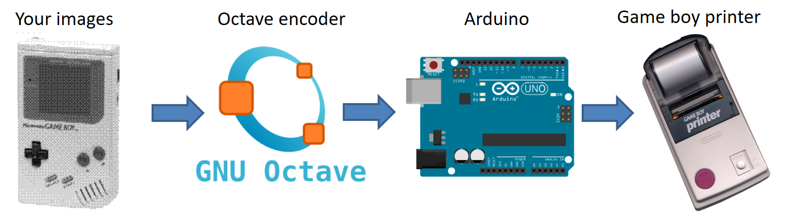

# A simple PC to Game Boy Printer interface with an Arduino

The most cheap and basic setup you can imagine to print something from a PC to a Game Boy Printer ! The code originates from an [SD based version](https://github.com/Raphael-Boichot/The-Arduino-SD-Game-Boy-Printer) which requires an SD shield. The project here requires nothing but an Arduino Uno and a PC. It is back compatible with the [Arduino Game Boy Printer Emulator](https://github.com/mofosyne/arduino-gameboy-printer-emulator) which natively embeds the small arduino core proposed here.

Here GNU Octave is used to encode images into Game Boy Tile Format, make legit printer packets with correct checksums and send them to the serial port in correct order. The Arduino acts as a luxury level shifter. It turns the asynchronous serial data sent to the Arduino into an SPI protocol compatible with the printer, in particular regarding timings and synchronous communication. 

## Parts needed

- An [Arduino Uno](https://www.aliexpress.com/item/1005002997846504.html);
- The [cheapest Game Boy serial cable you can find](https://fr.aliexpress.com/item/32698407220.html) as you will cut it. **Important note:** SIN and SOUT are crossed internally so never trust what wires you get. Use a multimeter to identify wires. Cross SIN and SOUT if the device does not work at the end;
- If you want something working first try, you can use a [serial port breakout board](https://github.com/Palmr/gb-link-cable) instead of cutting/soldering a cable.
- If you want something blinking, you can wire an aditionnal fancy LED to D13 with a 200-1000 Ohm resistor in series.

## Pinout 

The pinout uses only 4 wires, so it's very easy to make !

## Dedicated PCB

If you want something very neat, you can follow the [instructions given here](https://github.com/Raphael-Boichot/Collection-of-PCB-for-Game-Boy-Printer-Emulators?tab=readme-ov-file) to build a dedicated PCB. This PCB is also compatible with many other projects.

## How to use it

Well, this is as simple as it sounds:
- Install the [Arduino IDE](https://www.arduino.cc/en/software) and [GNU Octave](https://octave.org/);
- Clone the repo locally;
- Flash the [Arduino code](/Arduino_interface/Arduino_interface.ino) to your Arduino Uno. Change the pinout if necessary;
- Drop some images, **any size, any number of colors, png, bmp ot jpg format**, in the [image folder](/Octave_Interface/Images). 1x screenshots, 4 colors, made from emulators and images from Game Boy Camera fit perfectly the native printer resolution but are not mandatory. Other formats will be reduced to 160x(16xX), 2 bits per pixel images, Bayer dithering (like the Game Boy Camera);
- Connect the Game Boy Printer to the Arduino and the Arduino to the PC. The Arduino is ready as soon as the LED wired to D13 turns ON;
- Open [the Octave code](/Octave_Interface/Direct_Converter_packets_with_flux_control.m) and run it from the GNU Octave Launcher, it automatically detects the serial port. You must see some flashes of the LED if it's working;
- Enjoy your washed-out pictures !
- The Arduino onboard LEDs blink and it does not print ? Inverse physically SIN and SOUT, then retry !

## The protocol used here

This code prints packets by batches of 9 if possible, using double speed mode and applying flux control during printing time by inquiring the printer. It works basically like any printer compatible Game Boy game. It cannot be faster than that.

The repo also contains the first version of code which printed packets one by one without flux control, for history (it works of course). At that time I basically didn't know what I was doing due to peculiar way of GNU Octave to handle the serial protocol. I still do not know what I'm doing but the code works as intended.

## Example of fancy use: printing emulator screenshots

(Do not mind the mess of wires, it's just a prototyping board also used for other projects)

## Have you run out of paper ?

The repo also comes with a [fake printer](https://github.com/Raphael-Boichot/PC-to-Game-Boy-Printer-interface/tree/main/Research/The%20Fake%20Printer) that allows you to generate completely fake thermal prints having exactly the aspect of what a Game Boy Printer could produce. No batteries or thermal paper required ! 

## Acknowledgements

- [Andreas Hahn](https://github.com/HerrZatacke) for the [dithering pattern generator](https://herrzatacke.github.io/dither-pattern-gen/) which I took inspiration from.
- [Mraulio](https://github.com/Mraulio) for help and debugging.
- [AKABigDinner](https://github.com/AKABigDinner/PC-to-GameBoy-Printer-Python) for upgrading the project to Python with a fancy PCB.

