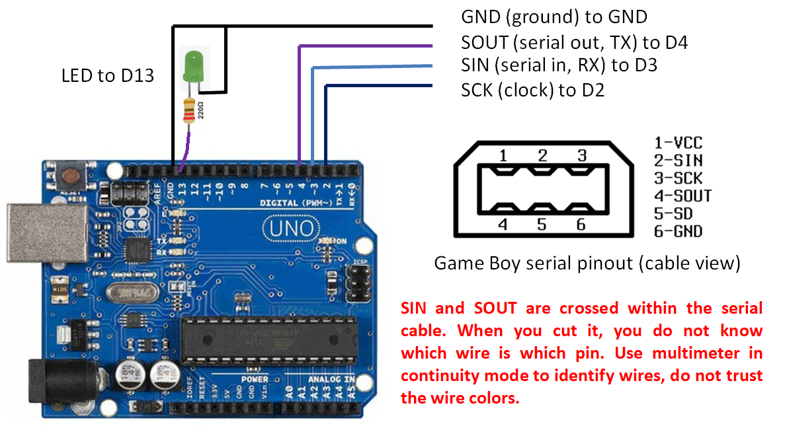
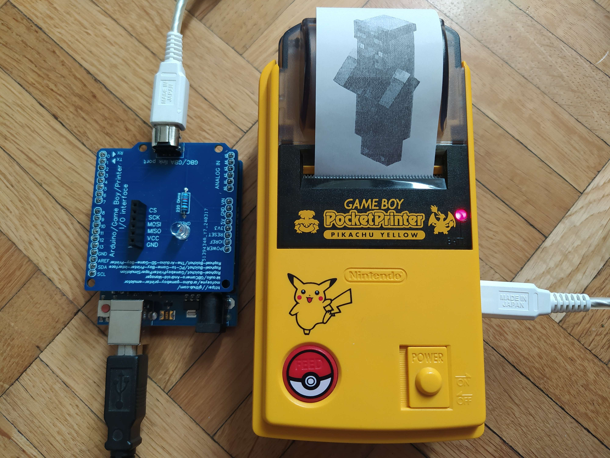

# PC to Game Boy Printer interface

The most cheap and basic device you can imagine to print something from a PC to a Game Boy Printer ! The Arduino code is the same used in the [GBCamera-Android-Manager](https://github.com/Raphael-Boichot/GBCamera-Android-Manager). The code originates from an [SD based version](https://github.com/Raphael-Boichot/The-Arduino-SD-Game-Boy-Printer/edit/master/README.md) which is technically fancier but requires and SD shield.

## Parts needed

- An [Arduino Uno](https://fr.aliexpress.com/item/32848546164.html);
- The [cheapest Game Boy serial cable you can find](https://fr.aliexpress.com/item/32698407220.html) as you will cut it. **Important note:** SIN and SOUT are crossed internally so never trust what wires you get. Use a multimeter to identify wires. Cross SIN and SOUT if the device does not work at the end.

## Pinout 

## How to use it

Well, this is as simple as it sounds:
- Install the [Arduino IDE](https://www.arduino.cc/en/software) and [GNU Octave](https://octave.org/);
- clone the repo locally;
- Flash the [Arduino code](https://github.com/Raphael-Boichot/PC-to-Game-Boy-Printer-interface/blob/main/Arduino_interface/Arduino_interface.ino) to your Arduino Uno;
- Drop some images 160 pixels width, multiple of 16 pixel height, 4 shades of gray (or less) in the [image folder](https://github.com/Raphael-Boichot/PC-to-Game-Boy-Printer-interface/tree/main/Octave_Interface/Images);
- Connect the Game Boy Printer to the Arduino;
- Open [the Octave code](https://github.com/Raphael-Boichot/PC-to-Game-Boy-Printer-interface/blob/main/Octave_Interface/Direct_Converter.m), select the COM port corresponding to your Arduino board and run the code from the GNU Octave Launcher;
- Enjoy you pictures !

## Example of fancy use

